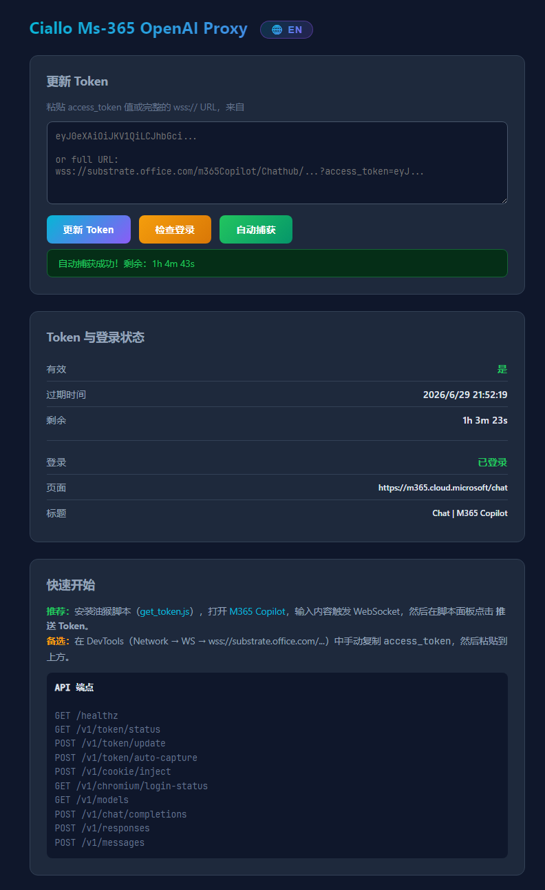

# Ciallo Ms-365 OpenAI Proxy (Docker)

将 Microsoft 365 Copilot 暴露为 OpenAI 兼容 API 的 Docker 代理服务。

基于 [m365-copilot-openai-proxy](https://github.com/kuchris/m365-copilot-openai-proxy)，封装为 Docker 镜像，支持：

- Chromium headless 自动刷新 Token（Cookie 登录后全自动）
- Tampermonkey 油猴脚本一键推送 Token + Cookie
- 多架构镜像 (amd64 + arm64)
- API Key 认证保护
- CORS 跨域支持
- Web 管理页面

## 快速部署

### 1. 创建 .env 文件

```bash
cp .env.example .env
```

### 2. 启动服务

```bash
docker-compose up -d
```

服务在 `http://localhost:8000` 启动，打开浏览器访问即为 Web 管理页面。

### 3. 推送 Token

#### 方式一：油猴脚本（推荐）

1. 安装 [Tampermonkey BATE](https://www.tampermonkey.net/) 浏览器扩展
2. 点击 Tampermonkey BATE 图标 → **添加新脚本**
3. 将 [get_token.js](https://raw.githubusercontent.com/MurasameCyan/M365-Copilot-OpenAI-Proxy/main/get_token.js) 的内容粘贴进去，保存
4. 打开 [M365 Copilot](https://m365.cloud.microsoft/chat) 并登录你的 M365 账号
5. 在 Copilot 对话框中**输入任意字符**触发 WebSocket 连接
6. 页面右上角弹出 Token 提取面板
7. 点击 **One-Click Setup** — 自动推送 Cookie + Token 到代理服务

> **首次需要先推送 Cookie** 让 Chromium headless 登录 M365，之后 Auto Capture 即可自动刷新 Token。

#### 方式二：手动粘贴

1. 在浏览器中打开 M365 Copilot
2. F12 → Network → WS → 找到 `wss://substrate.office.com/...` 连接
3. 复制 URL 中的 `access_token` 参数值
4. 粘贴到 Web 管理页面的 **Update Token** 输入框，点击 **Update Token**

#### 查看状态

Web 管理页面显示 Token 有效性和 Chromium 登录状态。点击 **Check Login** 检查 Chromium 是否已登录，点击 **Auto Capture** 让 Chromium 自动捕获新 Token。

## API 端点

| 端点                              | 说明                                |
| --------------------------------- | ----------------------------------- |
| `GET /healthz`                  | 健康检查                            |
| `GET /v1/token/status`          | Token 有效性与过期时间              |
| `POST /v1/token/update`         | 手动推送 Token                      |
| `POST /v1/token/auto-capture`   | 触发 Chromium 自动捕获 Token        |
| `POST /v1/cookie/inject`        | 注入 Cookie 到 Chromium             |
| `GET /v1/chromium/login-status` | Chromium 登录状态                   |
| `GET /v1/models`                | 模型列表                            |
| `POST /v1/chat/completions`     | OpenAI Chat Completions（支持流式） |
| `POST /v1/responses`            | OpenAI Responses API（支持流式）    |
| `POST /v1/messages`             | Anthropic Messages API（支持流式）  |

## 环境变量

| 变量                       | 必需 | 默认值              | 说明                                        |
| -------------------------- | ---- | ------------------- | ------------------------------------------- |
| `M365_ACCESS_TOKEN`      | 否   | —                  | Substrate Token，留空则由 Chromium 自动捕获 |
| `M365_TIME_ZONE`         | 否   | `Asia/Shanghai`   | 发送给 Copilot 的时区                       |
| `M365_MODEL_ALIAS`       | 否   | `m365-copilot`    | 模型名称                                    |
| `API_KEY`                | 否   | `ciallo-0d000721` | API Key 认证密钥，留空则不启用认证          |
| `AUTO_REFRESH`           | 否   | `true`            | 是否自动刷新 Token                          |
| `REFRESH_BEFORE_SECONDS` | 否   | `300`             | Token 过期前多少秒开始刷新                  |
| `CHROME_CDP_PORT`        | 否   | `9222`            | Chromium CDP 端口                           |

## 客户端配置

| 设置             | 值                                                |
| ---------------- | ------------------------------------------------- |
| Base URL         | `http://your-server:8000/v1`                    |
| API Key          | 你设置的 `API_KEY` 值（如未设置则填 `dummy`） |
| Model            | `m365-copilot`                                  |
| Persistent model | `m365-copilot:persist`                          |

### Claude Code

```bash
export ANTHROPIC_BASE_URL=http://your-server:8000
export ANTHROPIC_API_KEY=your-api-key   # 如未设置 API_KEY 则填 dummy
claude
```

### Cherry Studio / OpenCode

```
Base URL: http://your-server:8000/v1
API Key: your-api-key    # 默认 ciallo-0d000721
Model: m365-copilot
```

## API Key 认证

默认 API Key 为 `ciallo-0d000721`。在 `.env` 中设置 `API_KEY=your-secret-key` 可修改。所有请求需携带 `Authorization: Bearer your-secret-key` 头。

```bash
curl -H "Authorization: Bearer ciallo-0d000721" http://localhost:8000/v1/models
```

## 持久会话

- **Header 模式**：请求头 `X-M365-Session-Id: my-session`
- **模型后缀模式**：使用模型名 `m365-copilot:persist`

两种方式都会在同一 Copilot 对话中保留上下文。

## 架构

```
容器启动
  ├─ Chromium headless → m365.cloud.microsoft/chat (CDP 端口 9222)
  │   ├─ 登录状态持久化于 /chrome-profile volume
  │   └─ 通过 CDP 自动捕获 Substrate WebSocket Token
  │
  └─ ciallo-ms365-proxy serve (端口 8000)
      ├─ Web 管理页面 (/)
      ├─ Token 过期前 5 分钟自动刷新
      └─ 提供 OpenAI 兼容 API
```

## Web页面

## License

Apache License 2.0
